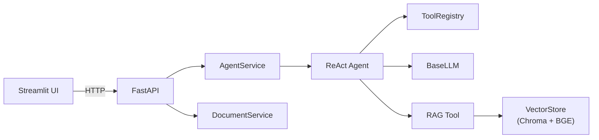
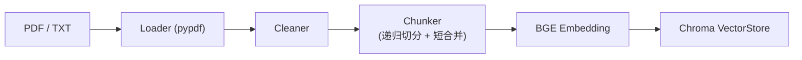
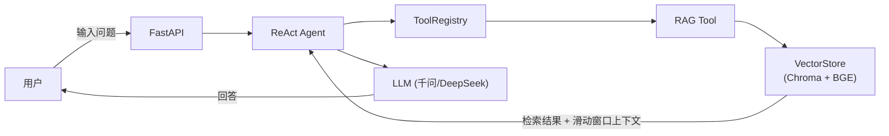

# AI 文档助手

> 基于自实现 RAG + ReAct Agent 的智能文档问答系统。核心逻辑不依赖 LangChain/LlamaIndex。

<p align="center">
  
  
  
</p>

---

## ✨ 项目亮点

- **自实现 ReAct Agent** — while + tool_calls 循环，不依赖 LangChain/LlamaIndex
- **自实现 RAG Pipeline** — loader → cleaner → chunker → vector store，全链路可控
- **FastAPI + Streamlit 前后端分离** — 瘦客户端模式，纯 httpx 调用
- **BGE + Chroma 中文检索** — bge-base-zh-v1.5，768 维中文语义向量
- **RAGAS 评测驱动优化** — Faithfulness 从 0.38 提升到 0.6353（+67%）
- **pytest + GitHub Actions** — 41 测试用例，CI 自动运行

---

## 功能概览

| 功能 | 说明 |
|------|------|
| 📄 **文档上传** | 支持 `.txt` / `.pdf`，自动清洗 + 递归切分 + 向量化 |
| 🔍 **语义检索** | Chroma 向量库，BGE 中文 embedding，top-k 可配 + 滑动窗口上下文 |
| 🤖 **ReAct Agent** | 自实现思考→行动→观察循环，支持多工具调用 |
| 💬 **多轮对话** | 聊天上下文记忆 + 工具调用历史 |
| 🛠️ **工具系统** | 可扩展 Tool 基类 + Registry 注册器（RAG 检索、计算器等） |
| 🌐 **REST API** | FastAPI 提供 `POST /chat`、文档 CRUD、健康检查 |
| 🖥️ **Streamlit UI** | 瘦客户端模式，纯 httpx 调后端，秒级启动 |
| ⚡ **异步桥接** | FastAPI 异步路由 → `asyncio.to_thread` → sync Agent |

---

## 系统架构



- **前端**：Streamlit 瘦客户端，纯 httpx 调用后端，无 Agent/Chroma 直接依赖
- **API 层**：FastAPI 提供 REST 接口（`/chat`、`/upload`、`/health`）
- **服务层**：AgentService 负责聊天编排，DocumentService 负责文档管理
- **Agent 核心**：自实现 ReAct 循环，通过 ToolRegistry 调用工具，BaseLLM 封装 OpenAI SDK
- **检索层**：RAG Tool 封装语义检索，Chroma + BGE 提供中文向量存储

---

## 文档处理流程（Document Pipeline）



- **Loader**：支持 `.txt` / `.pdf`，自动识别格式
- **Cleaner**：空行压缩、特殊字符过滤、全角半角统一
- **Chunker**：递归分割（段落→句子→字符），短段落阈值合并（最小 chunk = chunk_size × 0.4）
- **Embedding**：`bge-base-zh-v1.5`（768 维），中文语义匹配优化
- **存储**：Chroma 持久化向量库，内容哈希 ID 自动去重

---

## 对话流程（Chat Flow）



- 用户输入问题 → FastAPI 接收 → ReAct Agent 启动循环
- Agent 调用 RAG Tool 检索相关文档块（top-4 + 前后各 2 个相邻 chunk）
- 检索结果拼接上下文送入 LLM → 生成回答返回用户
- 滑动窗口上下文确保单 chunk 信息不完整时仍有足够的背景

---

## 快速开始

```bash
# 1. 克隆 & 进入
git clone https://github.com/AnruiRao/ai_doc_assistant.git
cd ai_doc_assistant

# 2. 配置环境变量
cp .env.example .env
# 填入 LLM_API_KEY（支持千问/DeepSeek 等 OpenAI 兼容协议）

# 3. 安装依赖
uv sync

# 4. 一键启动（FastAPI + Streamlit）
./run.sh

# 或手动启动 API 测试
uv run uvicorn src.api.main:app --reload
curl localhost:8000/health
curl -X POST localhost:8000/chat \
  -H "Content-Type: application/json" \
  -d '{"input_text":"你好","history":[]}'
```

### 环境变量

| 变量 | 说明 | 示例 |
|------|------|------|
| `LLM_API_KEY` | API Key | `sk-xxx` |
| `LLM_BASE_URL` | API 地址 | `https://dashscope.aliyuncs.com/compatible-mode/v1` |
| `LLM_MODEL` | 模型名 | `qwen3.6-max-preview`（默认） |

---

## 技术栈

| 层 | 技术 | 说明 |
|----|------|------|
| **Agent 框架** | 自实现 ReAct | 不依赖 LangChain/LlamaIndex，从零实现 tool_calls 循环 |
| **RAG Pipeline** | 自实现 | loader → cleaner → chunker → vector store，全链路可控 |
| **向量库** | Chroma | 本地持久化，零配置，BGE 中文 embedding（768 维） |
| **LLM 协议** | OpenAI 兼容 | 支持千问 / DeepSeek / GLM 等国产模型 |
| **后端 API** | FastAPI | 异步路由 + 服务层 + CORS |
| **前端** | Streamlit | 瘦客户端模式，纯 httpx 调用，无后端依赖 |
| **测试** | pytest + GitHub Actions | 41 测试用例，CI 自动运行 |
| **日志** | structlog | 开发彩显 / 生产 JSON，结构化追踪 |
| **异常** | 树形体系 | 7 类异常，区分可重试 / 不可重试 |

---

## 评测结果

使用 RAGAS 对 20 条测试 query 进行两维度评估（Faithfulness + Answer Relevancy）。

### 总体指标

| 指标 | V2 Baseline (MiniLM) | V3 优化后 (chunk合并 + BGE) | 改善 |
|------|-------------|---------------|------|
| **Faithfulness** | 0.38 | **0.6353** | **↑67%** |
| **Answer Relevancy** | 0.82 | **0.8819** | **↑7.5%** |

### 优化历程

| 轮次 | 改动 | 效果 |
|------|------|------|
| baseline | chunk_size=500, overlap=50, MiniLM | F=0.38, R=0.82 |
| 第 1 轮 | chunk_size 500→1000, overlap 50→100 | #1 ❌→✅ |
| 第 2 轮 | Agent 搜索次数限制 max_search=3 | 避免死循环 |
| 第 3 轮 | 滑动窗口（±2 相邻 chunk） | #11、#16 ⚠️→✅ |
| 第 4 轮 | chunk 短段落合并（决策 009） | 消除标题碎片 |
| 第 5 轮 | embedding 升级 BGE（决策 010） | 检索语义提升 |
| **汇总** | **chunk 合并 + BGE 双优化** | **F=0.38→0.6353（↑67%）** |

### 详细分数

```
高 Faithfulness (≥0.8) —— 回答忠实于检索上下文

  ✅ Agent.run 方法参数          1.000  — 完美命中
  ✅ 为什么选 Chroma             1.000  — 完美命中
  ✅ 为什么不用 LangChain         0.913  — 显著提升
  ✅ chunk_text vs recursive    0.911  — 显著提升
  ✅ 为什么选 MiniLM             0.905  — 保持高位
  ✅ Chunker/VectorStore 调用    0.862  — 改善

仍需关注 (<0.4)

  🔶 chunk_size/overlap 影响    0.177  — 分析型问题
  🔶 异常体系可重试类             0.194  — 列举型问题
  🔶 VectorStore 核心方法        0.289  — 列举型问题
  🔶 大文件处理                  0.306  — 假设型问题
```

> 低 Faithfulness 并非回答错误，而是 LLM 用自己的知识补全了检索缺失的细节。列举/假设/分析型问题是 RAG 检索的固有挑战。

详细评估脚本见 [`scripts/evaluate_rag.py`](scripts/evaluate_rag.py)，评分数据见 [`data/eval_scores.json`](data/eval_scores.json)。

---

## 项目结构

<details>
<summary><strong>点击展开项目目录</strong></summary>

```
ai_doc_assistant/
├── src/
│   ├── core/           抽象层
│   │   ├── config.py     Pydantic 配置 + from_env()
│   │   ├── llm.py        OpenAI SDK 封装（invoke + invoke_with_tools）
│   │   ├── agent.py      Agent ABC 基类
│   │   ├── exceptions.py 树形异常体系
│   │   ├── retry.py      tenacity 重试装饰器
│   │   ├── logging.py    structlog 结构化日志
│   │   └── async_utils.py asyncio.to_thread 桥接
│   ├── tools/
│   │   ├── base.py       Tool ABC 基类 + to_openai_tool()
│   │   ├── registry.py   ToolRegistry 注册器
│   │   └── impl/
│   │       ├── calculator.py   计算器工具
│   │       └── rag_tool.py     RAG 工具（save/search/delete/list）
│   ├── agents/
│   │   └── react_agent.py  ReAct 循环（同步 + 异步）
│   ├── ingestion/
│   │   ├── loader.py     load_text / load_pdf（pypdf）
│   │   ├── cleaner.py    文本噪声清理
│   │   └── chunker.py    递归切分 + 短段落合并
│   ├── retrieval/
│   │   └── vector_store.py  Chroma 封装 + BGE embedding
│   ├── services/
│   │   └── document_service.py  文档管理业务逻辑
│   ├── api/
│   │   ├── main.py       FastAPI 入口
│   │   ├── __init__.py   create_app() 工厂
│   │   ├── schemas/      Pydantic 请求/响应模型
│   │   └── routes/       health / chat / documents 路由
│   └── app/
│       └── ui.py          Streamlit 界面
├── tests/
│   ├── unit/             单元测试
│   ├── core/             LLM/Agent mock 测试
│   ├── services/         服务层测试
│   ├── api/              FastAPI 路由测试
│   └── integration/      集成测试
├── scripts/
│   ├── evaluate_rag.py   RAGAS 评估脚本
│   └── reindex.py        重索引脚本
├── docs/
│   └── decisions/        架构决策记录（001～010）
├── data/                 Chroma 向量库 + 文档注册表
├── pyproject.toml        项目配置 + 依赖
├── .github/workflows/    GitHub Actions CI
├── run.sh                一键启动脚本
├── PLAN.md               项目规划路线
├── TASKS.md              开发任务清单
└── LICENSE               MIT License
```

</details>

---

## 发展阶段

| 阶段 | 状态 | 内容 |
|------|------|------|
| **V1 Demo** | ✅ | Agent 核心 + RAG 检索 + Streamlit UI 全链路跑通 |
| **V2 工程化** | ✅ | 异常/重试/日志 → FastAPI/异步桥接 → 服务层 → 测试+CI |
| **V3 RAG 优化** | ✅ | chunk 短合并 → BGE embedding → RAGAS 评测（F=0.38→0.6353） |
| **V4 生产化** | 🔲 规划中 | Docker 部署 / 多用户 / 流式输出 / LangChain 适配层 |

---

## 决策记录

每个架构决策都记录了"为什么这样选"——选项对比、权衡分析、放弃的理由。

- [001: Embedding 模型选型](docs/decisions/001-embedding-model.md)
- [002: ReAct VS Plan&Execute](docs/decisions/002-react-vs-plan-execute.md)
- [003: Tool 系统设计](docs/decisions/003-tool-system-design.md)
- [004: Agent 多轮对话设计方案](docs/decisions/004-agent-conversation-design.md)
- [005: RAG Tool 设计](docs/decisions/005-rag-tool-design.md)
- [006: V2 异常体系设计](docs/decisions/006-v2-exception-hierarchy.md)
- [007: FastAPI + 异步桥接方案](docs/decisions/007-fastapi-async-bridge.md)
- [008: V3 滑动窗口上下文](docs/decisions/008-sliding-window-context.md)
- [009: Chunker 短段落合并](docs/decisions/009-chunk-fragmentation-merge.md)
- [010: Embedding 升级 BGE](docs/decisions/010-embedding-upgrade-v3.md)

---

## License

This project is licensed under the MIT License. See the [LICENSE](LICENSE) file for details.
